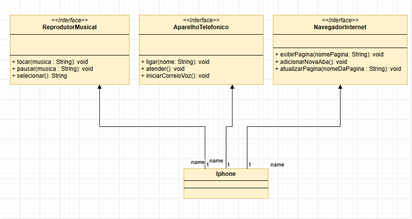

# Diagrama UML - Implementação de Interfaces do iPhone

## Descrição
O arquivo Diagrama.UML.drawio contém um diagrama de classes UML representando a implementação de interfaces para um modelo de um **iPhone**. O diagrama segue o princípio de programação orientada a objetos, definindo três interfaces principais que o **iPhone** implementa.

## Estrutura do Diagrama
O diagrama representa três interfaces e uma classe concreta:

### Interfaces:
1. **ReprodutorMusical**
   - Métodos:
     - `tocar(musica: String): void`
     - `pausar(musica: String): void`
     - `selecionar(): String`

2. **AparelhoTelefonico**
   - Métodos:
     - `ligar(nome: String): void`
     - `atender(): void`
     - `iniciarCorreioVoz(): void`

3. **NavegadorInternet**
   - Métodos:
     - `exibirPagina(nomePagina: String): void`
     - `adicionarNovaAba(): void`
     - `atualizarPagina(nomeDaPagina: String): void`

### Classe:
- **iPhone**
  - Implementa as três interfaces: `ReprodutorMusical`, `AparelhoTelefonico` e `NavegadorInternet`
  - Contém associações com cada interface, demonstrando a implementação de suas funcionalidades.

## Objetivo do Diagrama
Este diagrama tem como objetivo ilustrar a implementação de múltiplas interfaces em uma única classe concreta, seguindo boas práticas da Programação Orientada a Objetos (POO) e promovendo a reutilização de código.

## Como Usar
Este diagrama pode ser útil para:
- Estudos sobre implementação de interfaces em linguagens como Java, C# e outras que suportam POO.
- Compreender a estrutura de um sistema modular onde diferentes funcionalidades são desacopladas em interfaces específicas.
- Servir como base para implementação de um sistema que modele um smartphone com diversas funcionalidades.

## Contexto
Este diagrama foi criado para fins educacionais durante o desafio de POO da [DIO (Digital Innovation One)](https://www.dio.me) do **Bootcamp Bradesco - Java Cloud Native**

